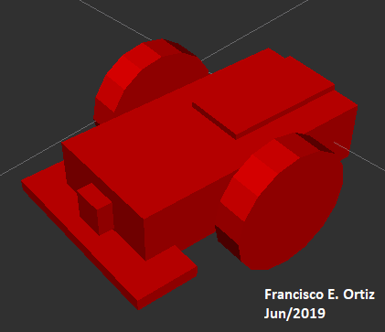
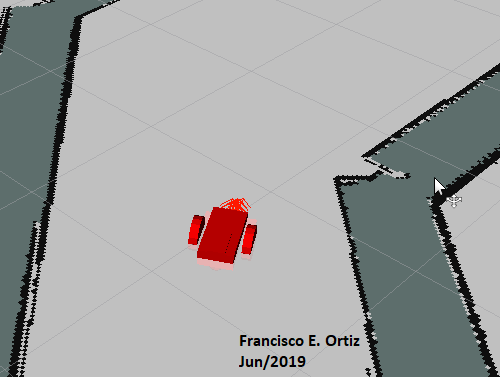

# Where Am I?
This project was developed to the Udacity Robotics Software Engineer Nanodegree, for the resolution of the localization robot where is apply Monte Carlo Localization (MCL) algorithm, as known as Particle Filter, in ROS environment to estimate the robot's own pose.

## Installation & Build
### ROS Kinetic
The project was developed on Ubuntu 16.04 LTS with [ROS Kinetic](http://wiki.ros.org/kinetic), [Gazebo](http://gazebosim.org/) and [catkin](http://wiki.ros.org/catkin) installed.

### Dependencies
The robot relies on the ``amcl`` and ``move_base`` ROS packages, which should be installed through ``apt-get``.

### Building the Workspace
Use ``catkin`` to build the packages from source. From ``catkin_ws``, run:

``catkin_make; source devel/setup.bash``

to build the workspace packages and add them to the paths of ROS.

### Running the Scripts
After the above steps, you should be able to run the commands below in separate terminals:

``roslaunch udacity_bot udacity_world.launch``

``roslaunch udacity_bot amcl.launch``

``rosrun udacity_bot navigation_goal``

## Project Content
### Directory Structure
The project repository contains source code of a ``catkin`` workspace, with some supporting code and shared object files provided by Udacity. All of them are wrapped in the ``udacity_bot`` package. The package includes a custom made robot model, a world file and map of an enclosed race track environment, a few configuration files for the parameters of ``amcl``, and a node that sends a navigation goal to the robot as it starts.

### Tasks
There are two tasks involved in this project: robot model configuration and ``amcl`` localization.
#### Robot Model Configuration
The robot model was built through editing the ``urdf`` file in the ``udacity_bot`` package to include two wheels, a main chassis, a laser rangefinder and an RGB camera. 

#### ``amcl`` Localization
The robot uses the information from the odometer, the camera and the laser rangefinder to localize itself through the ``amcl`` package. However, to successfully apply the algorithm, there are many parameters to tune for the specific robot and environment. As a result, the parameter files in the ``config`` directory contains up-to-date parameters that can allow the robot to accurately localize itself. With a good estimate of its pose, the robot was able to navigate to the designated goal.

